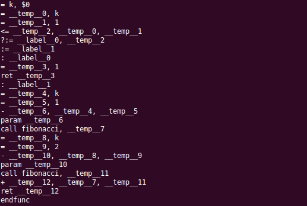

# MINI-L Compiler

A compiler for the Turing-complete language MINI-L. The compiler takes the source language and generates intermediate code to be interpreted and subsequently executed by the MIL interpreter. Provides robust error reporting when encountering any syntax or semantic errors.

Run "make" from within the directory to produce the compiler executable.

From there, run "./compile MINI-L_Program.min" which will produce the program's corresponding intermediate code.

To put the generated intermediate code into a file that can be run using the provided MIL interpreter(mil_run), use the command "./compiler MINI-L_Program.min > MINI-L_Program.mil"

Then to run the the MIL interpreter use the command "./mil_run MINI-L_Program.mil"

If input is required, the program will wait until the user has entered any required input. Sample programs have been provided in the programs/ folder. The provided samples include a Fibonacci sequence program and a prime number program.
